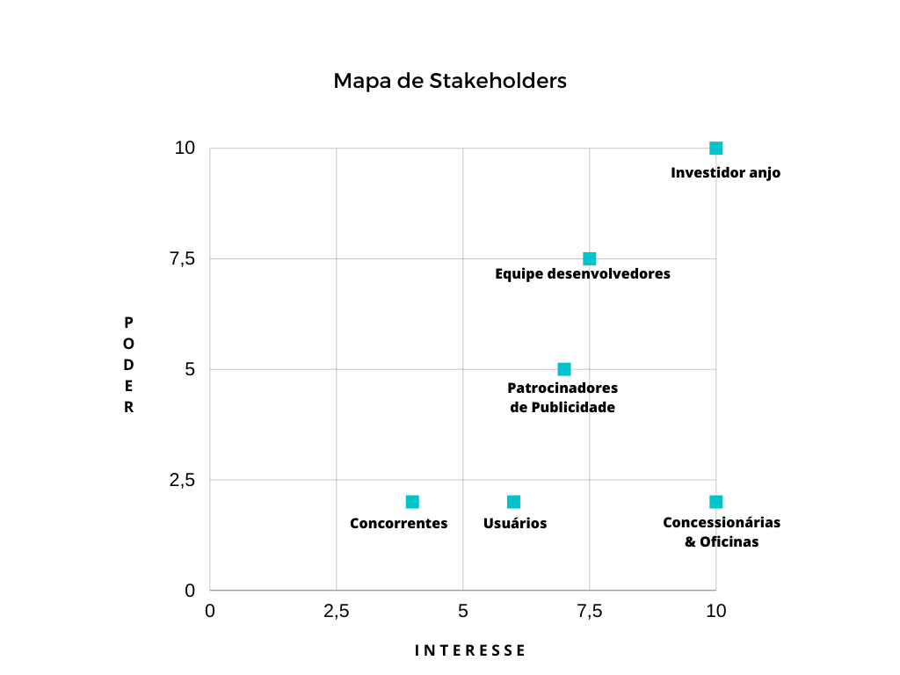

# Introdução

Conquistar novos clientes, uma nova oportunidade na carreira e vender seus serviços e produtos, são obstáculos enfrentados por um profissional autônomo. Em um mundo cada vez mais digital, recursos como ferramentas de marketing digital podem auxiliar esses profissionais (LAURIA, 2019). 

Através de portifólios online é possível exibir os melhores projetos e até mesmo vender produtos e serviços. Dessa forma, podem surgir novas oportunidades de emprego, afinal essas ferramentas podem ajudar na conquista de novos clientes e empregadores (“PORTIFÓLIO DIGITAL: O QUE É E QUAL A IMPORTÂNCIA PARA A SUA CARREIRA?”, 2021).

## Problema

A dificuldade de divulgação e venda de serviços de profissionais autônomos em páginas próprias. 

A questão da divulgação e venda de serviços de profissionais autônomos em suas próprias páginas é um desafio comum enfrentado por muitos indivíduos talentosos. Ter um portfólio online é apenas o primeiro passo; o próximo é atrair a atenção do público-alvo. Para superar essa dificuldade, é essencial adotar estratégias eficazes de marketing digital, como otimização de mecanismos de busca (SEO), presença ativa nas redes sociais e o uso inteligente de conteúdo de qualidade para envolver e educar potenciais clientes.

Além disso, estabelecer parcerias com outras empresas locais e participar de eventos da comunidade pode ser uma maneira poderosa de construir uma presença sólida e conquistar a confiança do público. O sucesso na divulgação e venda de serviços depende não apenas da qualidade do trabalho, mas também da habilidade em promovê-lo de forma eficaz no mundo digital em constante evolução.

Para tentar solucionar tais questões as propomos um template de curriculo no qual as pessoas possam dar publicidade aos seus trabalhos e serviços.

## Objetivos

O objetivo do projeto é criar uma aplicação Web, single page, utilizando react, no qual os usuários possam utilizar como base para criação de um currículo virtual e oferecer seus serviços com possibilidade de contato e link de pagamento
 

## Justificativa

AÉ amplamente reconhecido que a internet tem encurtado distâncias e provocado uma série de transformações nas nossas práticas de consumo, abrangendo áreas como entretenimento, compras online, métodos de estudo e até mesmo a busca por oportunidades de trabalho. De acordo com dados extraídos da Pesquisa dos Profissionais Brasileiros de 2019, conduzida pela Catho e que contou com a participação de mais de 6,2 mil entrevistados, a maioria dos profissionais atualmente recorre à internet em busca de oportunidades de emprego, sendo que 78% deles direcionam suas pesquisas para sites especializados em vagas de trabalho. 

Segundo informações veiculadas no portal Melhor RH, a pesquisa realizada pela Catho em 2020 estima que as pessoas que optam por procurar emprego de forma convencional, ou seja, indo pessoalmente a empresas e distribuindo currículos, incorrem em um custo mensal médio de cerca de R$ 300. Esse cálculo leva em consideração despesas relacionadas a transporte, alimentação, impressão de currículos e uso de internet móvel. Esses números destacam a relevância do ambiente online não apenas para a redução de custos, mas também para ampliar o alcance das oportunidades disponíveis, uma vez que a busca por emprego na internet é mais ágil e abrangente. 

Nesse contexto, o presente projeto foi concebido como uma resposta às dificuldades enfrentadas por aqueles que desejam criar currículos de fácil acesso e facilitar a divulgação de produtos e serviços, especialmente para trabalhadores autônomos atuando no cenário digital. O objetivo central deste projeto é simplificar a criação de currículos virtuais e portfólios, abrangendo diversas áreas, incluindo a venda de serviços. Além disso, busca-se facilitar os processos de divulgação e pagamento, para quem trabalha com venda de serviços e produtos, além de proporcionar agilidade para aqueles que estão em busca de novas oportunidades (“CERCA DE 80% DOS PROFISSIONAIS PROCURAM OPORTUNIDADES ONLINE”, 2020). 

## Público-Alvo

Profissionais autônomos de todas as áreas que desejam divulgar e vender seus serviços no ambiente virtual com mais facilidade e agilidade. 
   
<h2>Grafico Stakeholders<h2/>
 

## Estado da Arte
  - Moto Manutenção Programada - planilha para ajudar no controle de revisão da moto onde o proprietário alimenta o aplicativo.
   
   

   
   
  
 
  
  - Carango - controle de revisão e gerenciamento do veículo onde o proprietário alimenta o aplicativo.
  
  

 

 

Nenhum deles possui um bom serviço de comunicação entre a oficina e o usuário.
    
# Questões Éticas

O aplicativo deverá respeitar e estar de acordo com a LGPD (Lei Geral de Proteção de Dados Pessoais), além de prezar sempre pela privacidade do usuário.

Referências:
http://www.planalto.gov.br/ccivil_03/_ato2015-2018/2018/lei/l13709.htm

   
# Impactos Socias

Atualmente, devido o aumento constante no consumo e circulação de motocicletas desde o início da pandemia, justificado pela expansão dos serviços de entrega (delivery), a maior acessibilidade financeira das motos, tanto no preço do veículo quanto na economia em gastos com combustível, atenuou-se também o número de acidentes de trânsito envolvendo motociclistas, assim como, em muitos casos, a preocupação dos condutores em preservar seus veículos por se tratarem de instrumentos de trabalho.  

Em virtude do cenário atual, é inegável que a manutenção preventiva e cuidados com o veículo são também importantes medidas de segurança no trânsito, pois diminui as possibilidades do condutor se envolver em um acidente devido ao desgaste natural dos componentes do seu veículo e, além disso,a manutenção preventiva é mais barata que a corretiva, sendo a melhor alternativa em termos de economia para o motociclista.  

Sabendo que, atuar preventivamente permite ao usuário programar sua agenda — vendo a sua disponibilidade e a do mecânico/oficina — e suas finanças, uma vez que todas as manutenções preventivas são preestabelecidas, e, por outro lado, entendendo que a gestão dos diversos sistemas do veículo devem ser acompanhadas rigorosamente para que o condutor da motocicleta não caia no erro de fazer uma manutenção preventiva sem programação, tendo como consequência substituir peças que ainda não estão no período de troca e, assim, ter prejuízo, pode-se afirmar que o uso de aplicações web que auxiliam na gestão de controle da manutenção e revisão de motocicletas tem um papel importante e essencial na vida de muitos condutores.  

Dado o exposto na pesquisa, conclui-se que, o projeto de Aplicação Web de assistência no controle de revisão de motocicletas ajudará a combater os acidentes de trânsito causados por falhas mecânicas por meio de manutenção preventiva realizada de forma adequada e também na redução de gastos para o usuário, oferecendo suporte na organização, enviando lembretes sobre datas previstas para novas manutenções, registrando o histórico do veículo e gastos com o mesmo, facilitando o acesso a informações sobre a motocicleta por parte do mecânico e condutor do veículo e oferecendo um meio prático e rápido de comunicação entre a oficina e o dono da moto, mantendo assim, o motociclista sempre atento aos cuidados necessários com seu veículo. 

 

